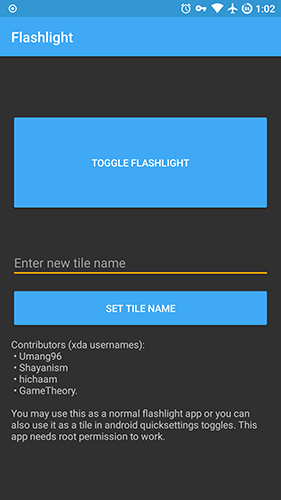

## Flashlight Tile Fix App for Custom ROMs

This app is to fix the broken flashlight and quicksettings flashlight tile in some custom roms. The app works on a very limited number of devices. Make sure to enable this apps' tile in the quicksettings instead of the stock tile. Root required.

**Devices tested**
- Redmi Note 3
- ZTE Zmax Pro Z981

**Developers (XDA usernames)**
- Umang96
- Shayanism
- hichaam
- GameTheory.

**Other Projects**
- https://intechgeek.com/
